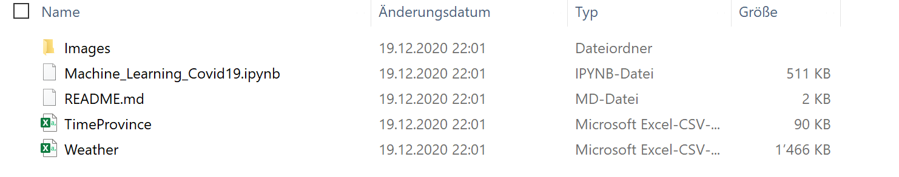

# Machine Learning COVID-19
## Goal
The goal of this project is to build a Machine Learning Algortihm that predicts COVID-19 Cases based on weather data. With this I want to find out wether weather is a good predictor for COVID-19 and more specifically how good of a predictor weather is for COVID-19 cases. The goal is **not** to build the best algorithm to predict case numbers (for that I would have used different data) but to predict case numbers based on the weather and to see how good this works.

## Data used
For this project I used data from two datasets I found on kaggle (https://www.kaggle.com/kimjihoo/coronavirusdataset). The datasets are about COVID-19 in South Korea in the period till 30/06/2020. The first dataset *TimeProvince.csv* contains data about daily case numbers in different South Korean provinces. The second dataset *Weather.csv* contains different weather measurements for the provinces in the first dataset.

## Machine Learning Methods
The Machine Learning model used in this project is **Random Forest**. The conceptual idea behind a Random Forest will be explained in great detail in the Jupyter Notebook.

## Programming Language
The programming language used in this proect is Python. The coide was written in a Jupyter Notebook using Anaconda.
 
## Packages needed
- pandas
- sklearn
- numpy
- matplotlib
- pydot

## How to run?
If you want to run this project you need to do following steps:
1. Donwload the jupyter Notebook *Machince_Learning_Covid19.ipynb* and both datasets *TimeProvince.csv* and *Weather.csv*. Put all files in the **same** directory/folder. You should have a folder that looks like this:

2. 

## Installation

## Credits
Give proper credits. This could be a link to any repo which inspired you to build this project, any blogposts or links to people who contrbuted in this project. 

